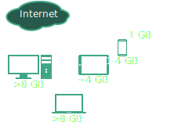
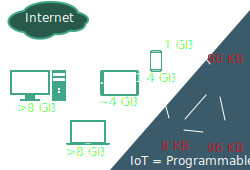
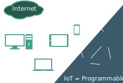
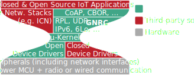

---
toc: true
toc-title: true
section-titles: false
title: RIOT in a Nutshell
subtitle: I3 Kickoff
author: Martine Lenders
date: "12.09.2016"
theme: RIOT
mainfont: Miso
...

# Why an Operating System for the IoT/Industry 4.0?
## Why an Operating System for the IoT?

- the current Internet is mostly consisting of devices obeying Moore's Law:
    - exponential growth in complexity over time

## Why an Operating System for the IoT?

- constrained IoT devices don't obey Moore's Law:
    - to save cost: very small RAM, very little processing power
- instead of going bare-metal on these platforms ...

## Why an Operating System for the IoT?

- go for a very small OS:
    - IoT requires complex software like a network stack
    - non-portable IoT software slows innovation
    - 90% of IoT software should be hardware-independent
- if you can't use Linux, use RIOT

# Why RIOT?
## RIOT in One Slide

* RIOT = a platform for **portable IoT software** based on:
    - *open-source*
    - *open-access protocol specs*
    - *community-driven development*

## Benefits of RIOT
* RIOT is the combination of
    - **memory & energy efficient** design to fit IoT devices
        + RAM/ROM requirements <5 KB
    - functionalities of a **full-fledged operating system**
        + real-time capabilities
        + multi-threading
        + modular design
        + advanced, consistenet API across 32-bit, 16-bit, 8-bit hardware \
          (incl. POSIX)
        + easy integration of third-party software packages
    - well-known development tools, standard C and C++ programming

# Outlook: RIOT and I3
## RIOT Today
* \>100 contributors from all around the world
* contributions from
    - industry
    - academia
    - makers/tinkerers
* support for ICN technologies as third-party software packages:
    - CCN-lite
    - NDN-RIOT

## Our Vision
* secure and efficient 5G industrial Internet by lightweight system and network
  solutions
* RIOT as open platform to promote and develop open Information Centric
  Networking standards
* RIOT envisioned as the Linux for constrained IoT devices
    - in terms of technology, openness, and community
