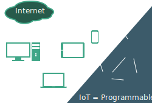

---
toc: true
toc-title: true
section-titles: false
title: RIOT
subtitle: The Friendly Operating System for the IoT
author:
  - Katja Kirstein
  - Martine Lenders
  - Lotte Steenbrink
date: "Oct 29th 2016"
theme: RIOT
mainfont: Miso
...

# What is RIOT?
## What is RIOT?
* Free operating system for
    - Embedded systems
    - The Internet of Things (IoT)
* Real-time capable micro-kernel
* Open Software, Open Standards (close ties between RIOT and IETF community)
* \>98% of code-base in C
* On application level:
    - partly POSIX compliant (libc, sockets, pthreads, ...)
    - C++ support (incl. rudimentary Arduino-like API)
    - (Micro-)Python and Rust support pending

# Why RIOT?
## Why RIOT?

## Why RIOT?

## Why RIOT?

# RIOT today
## RIOT today
* \>150 contributors world-wide
* Contributions from
    - industry
    - academia
    - makers/tinkerers
* 1st RIOT community summit in June 2016, next one already planned
* Full UDP/IPv6 over IEEE 802.15.4 (aka 6LoWPAN) stack
* Support for various CPU architectures:
    - ARM Cortex-M / ARM7
    - TI MSP430
    - Atmel AVR (Arduino)
    - (x86)
