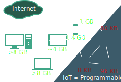

---
toc: true
toc-title: true
section-titles: false
title: RIOT
subtitle: The Friendly Operating System for the IoT
author:
  - Martine Lenders
  - Lotte Steenbrink
date: "Oct 29th 2016"
theme: RIOT
mainfont: Miso
...

# What is RIOT?
## What is RIOT?
* Free (LGPLv2.1) operating system for
    - Embedded systems
    - The Internet of Things (IoT)
* Real-time capable micro-kernel
* Open Software, Open Standards (close ties between RIOT and IETF community)
* \>98% of code-base in C
* On application level:
    - Partly POSIX compliant (libc, sockets, pthreads, ...)
    - C++ support (incl. rudimentary Arduino-like API)
    - (Micro-)Python and Rust support pending

# Why RIOT?
## Why RIOT?

## Why RIOT?

## Why RIOT?

# RIOT today
## RIOT today
* \>150 contributors world-wide
* Contributions from
    - Industry
    - Academia
    - Makers/tinkerers
* Full UDP/IPv6 over IEEE 802.15.4 (aka 6LoWPAN) stack
* Support for various CPU architectures:
    - ARM Cortex-M / ARM7
    - TI MSP430
    - Atmel AVR (Arduino)
    - (x86)
    - MIPS pending

# Meet us!
## Meet us!
* Monthly Hack'n'ACK party (last Tuesday of the month, 5pm)
    - Drink beer, eat pizza, get your PRs merged
    - Next: November 29th, 2016
        + Berlin: FU Berlin, Takustr. 9, 14195 Berlin
        + Hamburg: HAW Hamburg, Berliner Tor 5, 20099 Hamburg
        + (Saclay: INRIA Saclay, 1 Rue Honoré d'Estienne d'Orves, 91120 Palaiseau)
        + Or join remotely (lookout for the PlaceCam link at devel@riot-os.org)
* Annual RIOT community summit:
    - 1st in June 2016
    - Next: already planned (accompanying ACM ICN in Berlin,
      September 2017, see https://summit.riot-os.org)
* Find us at IETF meetings (at least Europe- and (N/S)-America-based)
