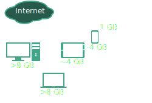

---
toc: true
toc-title: true
section-titles: false
title: RIOT
subtitle: The Friendly Operating System for the IoT
author: Martine Lenders (Projekt I3, Dr. Matthias Wählisch)
date: "12.10.2016"
theme: RIOT
mainfont: Miso
...

# Was ist RIOT?
## Was ist RIOT?
* Freies Betriebssystem für
    - Eingebettete Systeme
    - Das Internet der Dinge (Internet of Things, IoT)
* Echtzeit-fähiger Mikrokernel
* Entwicklung in Kooperation von FU Berlin, HAW Hamburg und INRIA

# Warum RIOT?
## Warum RIOT?

## Warum RIOT?

## Warum RIOT?

# RIOT heute und am Institut
## RIOT heute und am Institut
* \>150 Mitentwickler weltweit
* Mitentwickler und Maintainer am Institut
    - Dr. Emmanuel Baccelli (INRIA)
    - Oliver Hahm (INRIA)
    - Martine Lenders (FU Berlin)
    - Hauke Petersen (FU Berlin)
    - Dr. Matthias Wählisch (FU Berlin)

# Macht mit!
## Macht mit!
* RIOT-Entwicklung eng in die Lehre eingebunden:
    * Softwareprojekt Telematik
    * Abschlussarbeiten
* Beispiele:
    * Netzwerkstack (mehrere Bachelor- und Masterarbeiten)
    * CBOR (Softwareprojekt Telematik)
* Oder steigt ein auf https://github.com/RIOT-OS/RIOT
